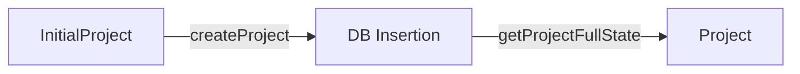

# Project State Architecture: Strict State Transitions

## Overview

We have implemented a strict One-Way State Transition architecture to ensure type safety and data integrity throughout the application lifecycle.

## The State Machine

The project lifecycle moves strictly from a "Loose" creation state to a "Strict" runtime state.



### 1. InitialProject (Creation State)
**Purpose**: Represents a project that is being created or is in a partial state before the first storyboard generation.
- **Schema**: `InitialProjectSchema`
- **Characteristics**:
  - `metadata`: Uses `InitialProjectMetadataSchema` (allows optional fields like `enhancedPrompt`).
  - `storyboard`: Uses `InitialStoryboard` (allows empty arrays for characters/scenes).
  - Used strictly for **inputs** to the repository (creation).

### 2. Project (Runtime State)
**Purpose**: Represents a fully valid, hydrated project used by application logic (Workflow, Agents, API).
- **Schema**: `ProjectSchema`
- **Characteristics**:
  - **Strict**: No optional fields for core data.
  - `metadata`: Uses `ProjectMetadataSchema` (all fields required).
  - `storyboard`: Uses `Storyboard` (immutable snapshot, must be populated).
  - `metrics`: Must be present (defaults provided if missing).
- **Guarantee**: Application logic receiving a `Project` object can operate without defensive null checks for core properties.

## Repository Contract

The `ProjectRepository` adheres to a strict contract:
1. **Inputs**: Accepts `InitialProject` (or `Partial<InitialProject>`) for flexibility.
2. **Persistence**: Maps loose types to DB columns (which support the loose structure).
3. **Outputs**: **ALWAYS** returns a validated `Project` object via `getProjectFullState()`.
   - It **throws** if the project data in the DB does not satisfy the strict `ProjectSchema`.
   - This ensures that any "broken" or partial state is caught at the persistence boundary, not deep in application logic.

## Usage Guide

### Creating a Project
```typescript
const minimalInput: InitialProject = {
  // ... minimal fields
  metadata: { projectId, initialPrompt: "foo" } 
};
// Returns a full PROJECT object (with defaults filled)
const project = await repo.createProject(minimalInput);
```

### Updating Initial State (Pre-Storyboard)
Use `updateProject` to modify state before the full storyboard exists (e.g. updating metadata, status).
```typescript
await repo.updateProject(projectId, { 
  status: "generating",
  metadata: { ... } 
}); // Returns InitialProject (loose validation)
```

### Application Logic
Always use the `Project` type in your functions.
```typescript
function processProject(project: Project) {
  // Safe to access without ?.
  console.log(project.metadata.title); 
  console.log(project.scenes[0].id);
}
```
