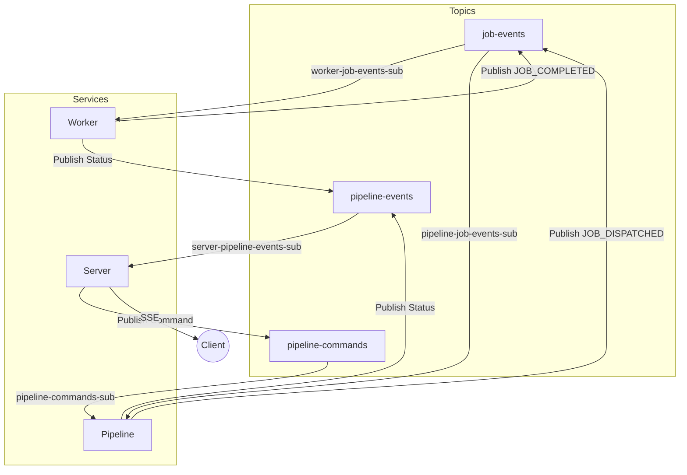

# Pub/Sub Architecture & Operation

In the refactored architecture, Google Cloud Pub/Sub operates as the asynchronous messaging backbone connecting the **Server**, **Pipeline**, and **Worker** services. This decoupling allows each service to scale independently and handle failures gracefully.

## 1. Core Concepts
*   **Topics** are named channels where publishers send messages (e.g., "A job happened").
*   **Subscriptions** are durable queues attached to topics where subscribers listen for messages. Multiple subscriptions on the same topic allow for **Fan-Out** (everyone gets the message), while multiple listeners on the same subscription allow for **Load Balancing** (one worker gets the message).

## 2. Operational Data Flow

### A. Job Execution Loop (The "Work" Cycle)
*   **Dispatch**: The **Pipeline** publishes a `JOB_DISPATCHED` event to the `job-events` topic.
*   **Process**: The **Worker** receives this via the [`worker-job-events-subscription`](../src/shared/constants.ts) (load-balanced across all workers).
*   **Completion**: When finished, the **Worker** publishes a `JOB_COMPLETED` event back to the `job-events` topic.
*   **Update**: The **Pipeline** receives this completion via the [`pipeline-job-events-subscription`](../src/shared/constants.ts) to update the workflow state.
    *   *Improvement*: This split subscription prevents workers from "stealing" completion events meant for the pipeline.

### B. Command Control (User Actions)
*   **User Action**: When a user clicks "Start" or "Stop" in the UI, the **Server** publishes a command (e.g., `START_PIPELINE`) to the `pipeline-commands` topic.
*   **Execution**: The **Pipeline** service listens on the [`pipeline-commands-subscription`](../src/shared/constants.ts) to execute the logic.
*   **Cancellation**: For stopping operations, a dedicated `pipeline-cancellations` topic broadcasts to all workers (Fan-Out) so the specific worker handling that project can abort immediately.

### C. Frontend Updates (Real-time Status)
*   **Events**: As work progresses, both **Pipeline** and **Worker** publish status updates (e.g., `SCENE_UPDATE`) to the `pipeline-events` topic.
*   **Forwarding**: The **Server** listens via the [`server-pipeline-events-subscription`](../src/shared/constants.ts) and forwards these events to the browser via Server-Sent Events (SSE).

## Architecture Diagram

