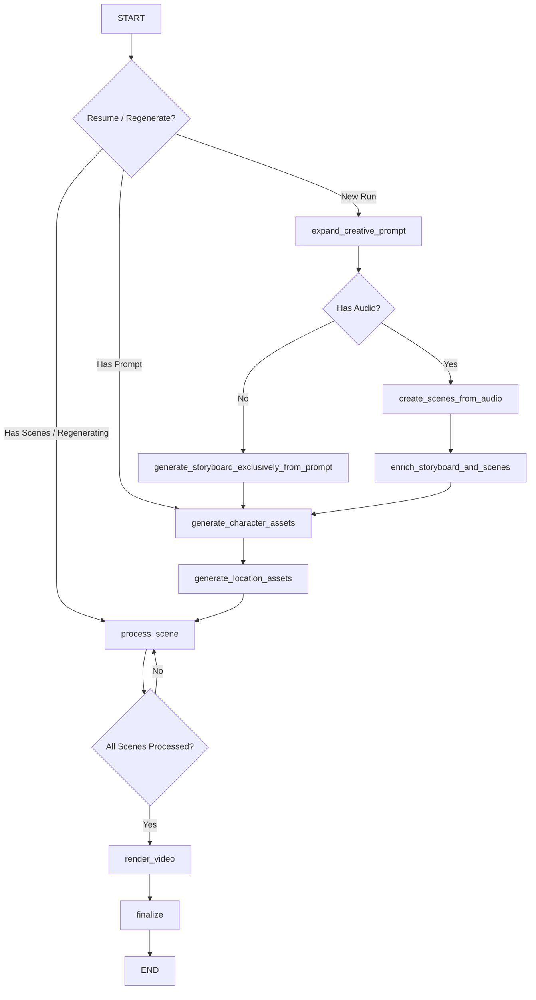

# Role-Based Prompts - Workflow Integration and Command Orchestration

**Version:** 3.2.0
**Date:** 2025-12-13
**Status:** ✅ Fully Integrated (with command-driven, persistent workflow)

---

## Overview

The role-based prompt architecture remains fully integrated throughout the cinematic video generation workflow, ensuring detailed, role-specific specifications are used at every stage. This architecture is now underpinned by a **command-driven orchestration layer** utilizing **Google Cloud Pub/Sub** for communication between the API server and the stateless `pipeline-worker` worker service. Persistent state management via **PostgreSQL checkpoints** guarantees reliable execution, enabling features like pipeline resume, explicit stop, and scene retries.

## Workflow Diagram



---

## Workflow Orchestration: Command-Driven Model

Execution is no longer initiated by a single monolithic script call. It is now managed by publishing commands to the `video-commands` Pub/Sub topic.

### Command Flow:

1.  **Client Action**: User triggers an action (e.g., Start, Stop) via the UI, which calls the stateless API server (`/api/video/start`).
2.  **Command Publishing**: The API server validates the request and publishes a structured **Command** (e.g., `START_PIPELINE`) to the `video-commands` topic.
3.  **Worker Subscription**: The `pipeline-worker` service subscribes to this topic and executes the command using the LangGraph instance, referencing the `projectId` as the run ID/thread ID.
4.  **State Persistence**: The worker saves the graph state to PostgreSQL after every significant step (or on command).
5.  **State Broadcasting**: The worker publishes events (e.g., `FULL_STATE`, `SCENE_COMPLETED`) to the `video-events` topic.
6.  **Client Feedback**: The API server streams relevant events back to the connected client via project-specific SSE connections.

### Key Commands Supported:

| Command | Triggered By | Effect |
| :--- | :--- | :--- |
| `START_PIPELINE` | API POST `/api/video/start` | Initiates a new graph run or resumes from the latest checkpoint. |
| `STOP_PIPELINE` | API POST `/api/video/stop` | Signals the worker to halt processing and persist the current state as a final checkpoint. |
| `REGENERATE_SCENE` | API POST `/api/video/regenerate` | Instructs the worker to rewind the state to a specific scene and restart generation. |
| `REQUEST_FULL_STATE` | Client connection event | Asks the worker to publish the latest known state back to the client. |

---

## Integration Points (Role-Based Prompting)

The role-based composition system integrates seamlessly into this new command-driven workflow because the agent's context (including temporal state) is reliably loaded from the PostgreSQL checkpoint before any decision or generation step.

### 1. **Storyboard Generation** (Generation Point 1.4)
**Agent:** `CompositionalAgent`
**File:** [pipeline/agents/compositional-agent.ts](pipeline/agents/compositional-agent.ts)

#### Initial Context Generation
- **Function:** `_generateInitialContext()`
- **Role Prompt Used:** `buildDirectorVisionPrompt()` from [role-director.ts](pipeline/prompts/role-director.ts)
- **Purpose:** Establishes creative vision, characters, locations, and scene structure.
- **Output:** Metadata, Character list, Location list

#### Scene Enrichment (Batch Processing)
- **Function:** `generateStoryboard()`
- **Composition Used:** `composeStoryboardEnrichmentPrompt()` from [pipeline/prompts/prompt-composer.ts](pipeline/prompts/prompt-composer.ts)
- **Roles Combined:** Director, Cinematographer, Gaffer.
- **Output:** Enriched scenes with technical specifications

**Changes Made:**
```typescript
// AFTER (role-based composition)
const systemPrompt = composeStoryboardEnrichmentPrompt(
  enhancedPrompt,
  initialContext.characters,
  initialContext.locations
);
```

---

### 2. **Character & Location Reference Images** (Generation Point 2.1)
**Agent:** `ContinuityManagerAgent`
**File:** [pipeline/agents/continuity-manager.ts](pipeline/agents/continuity-manager.ts)

#### Character Reference Images
- **Function:** `generateCharacterAssets()`
- **New Feature:** Now accepts an optional `onProgress` callback to provide real-time status updates (via `SCENE_UPDATE` events) for scenes related to the character being generated.
- **Role Prompt Used:** `buildCostumeAndMakeupPrompt()` via wrapper [pipeline/prompts/character-image-instruction.ts](pipeline/prompts/character-image-instruction.ts)
- **Department:** Costume & Makeup
- **Output:** Reference images for each character

#### Location Reference Images
- **Function:** `generateLocationAssets()`
- **New Feature:** Now accepts an optional `onProgress` callback to provide real-time status updates (via `SCENE_UPDATE` events) for scenes related to the location being generated.
- **Role Prompt Used:** `buildProductionDesignerPrompt()` via wrapper [pipeline/prompts/location-image-instruction.ts](pipeline/prompts/location-image-instruction.ts)
- **Department:** Production Design
- **Output:** Reference images for each location

---

### 3. **Scene Keyframe & Video Generation** (Generation Points 3.1, 3.2, 3.3)
**Agent:** `ContinuityManagerAgent`
**File:** [pipeline/agents/continuity-manager.ts](pipeline/agents/continuity-manager.ts)

#### Frame Generation Checkpointing (New)
The `ContinuityManagerAgent` now checks Google Cloud Storage for existing `scene_start_frame` and `scene_end_frame` objects (using `storageManager.fileExists`) before initiating image generation. This ensures that if the pipeline is resumed, or if a frame was previously generated but the state save failed, the existing frame is loaded, maintaining idempotency and accelerating recovery.

#### Scene Enhancement & Refinement
- **Function:** `prepareAndRefineSceneInputs()`
- **Composition Used:** `composeEnhancedSceneGenerationPrompt()` from [pipeline/prompts/prompt-composer.ts](pipeline/prompts/prompt-composer.ts)
- **Roles Combined:** Director, Cinematographer, Gaffer, Script Supervisor, Costume & Makeup, Production Designer.
- **Key Improvement:** Enhanced prompt generation incorporating full temporal state context, which is reliable due to checkpointing.
- **Observability:** Now logs the Meta-Prompt instructions (first 500 chars) and the final generated video prompt to the console, providing transparency into the LLM's synthesis process.

---

### 4. **Keyframe Generation** (Generation Points 3.1 & 3.2)
**Agent:** `FrameCompositionAgent` (Invoked by ContinuityManagerAgent)
**File:** [pipeline/agents/frame-composition-agent.ts](pipeline/agents/frame-composition-agent.ts)

#### Start & End Frame Generation
- **Function:** `generateImage()`
- **Composition Used:** `composeFrameGenerationPrompt()` via wrapper [pipeline/prompts/frame-generation-instruction.ts](pipeline/prompts/frame-generation-instruction.ts)
- **Roles Combined:** Cinematographer, Gaffer, Script Supervisor, Costume & Makeup, Production Designer.
- **Output:** Start and end keyframes for each scene. **Crucially, the `ContinuityManagerAgent` now ensures these frames are persistent in GCS before the graph proceeds, allowing for robust pipeline resumption.**
- **Observability:** Includes verbose logging of the Frame Meta-Prompt instructions and the resulting generated prompt, aiding in debugging frame composition issues.

---

### 5. **Quality Evaluation** (Generation Point 4.1)
**Agent:** `QualityCheckAgent`
**File:** [pipeline/agents/quality-check-agent.ts](pipeline/agents/quality-check-agent.ts)

#### Scene Video Evaluation & Frame Quality Evaluation
- **Composition Used:** Role-based evaluation prompts utilizing [pipeline/prompts/evaluation-guidelines.ts](pipeline/prompts/evaluation-guidelines.ts).
- **Key Improvement:** Evaluation is rigorous and department-specific. All results (scores, issues) are immediately checkpointed, informing any subsequent `RETRY_SCENE` command.

---

## Temporal State Tracking Integration

Temporal state tracking for Characters and Locations is now a fundamental part of prompt context. This context is reliably available because the entire scene's state is checkpointed before frame/video generation.

### Progressive Character State
All prompts now incorporate character temporal state via `formatCharacterTemporalState()`:
- Injuries (type, location, severity, scene acquired)
- Dirt level progression
- Exhaustion level
- Sweat level
- Costume condition (tears, stains, wetness, damage)
- Hair condition (messiness, wetness)

### Progressive Location State
All prompts now incorporate location temporal state via `formatLocationTemporalState()`:
- Time of day with history
- Weather progression with intensity
- Precipitation level
- Visibility conditions
- Ground condition (wetness, debris, damage)
- Broken objects persistence
- Atmospheric effects (fog, smoke, dust)

**Implementation:** See [pipeline/prompts/prompt-composer.ts](pipeline/prompts/prompt-composer.ts) for state formatting utilities.

---

## File Structure Updates

The core workflow has been modularized across three services: `client`, `server` (API/SSE), and `pipeline-worker` (Worker).

```
/
├── client/                           # Frontend (React/Vite)
├── server/                           # Stateless API Gateway, Pub/Sub Publisher/Subscriber for SSE
├── pipeline-worker/                 # Dedicated service running LangGraph (Worker)
│   ├── Dockerfile                    # Worker build file
│   ├── checkpointer-manager.ts       # Abstraction layer for Postgres Checkpointer
│   └── index.ts                      # Main logic subscribing to commands
├── pipeline/                         # Core business logic (Agents, LLM calls, Graph definition)
├── shared/                           # Cross-service shared types
│   ├── pipeline-types.ts             # GraphState definition
│   └── pubsub-types.ts               # Command/Event definitions (START_PIPELINE, FULL_STATE, etc.)
├── docker-compose.yml                # Local orchestration
└── ...
```

---

## Documentation References

- [PROMPTS_ARCHITECTURE.md](PROMPTS_ARCHITECTURE.md) - Role-based architecture design
- [IMPLEMENTATION_SUMMARY.md](IMPLEMENTATION_SUMMARY.md) - Details on the pipeline-worker service
- [SCHEMA_COMPOSITION_UPDATE.md](SCHEMA_COMPOSITION_UPDATE.md) - Type system improvements
- [TEMPORAL_TRACKING.md](TEMPORAL_TRACKING.md) - Details on state evolution across scenes

---

## Summary

✅ **The workflow is now decoupled, persistent, and command-driven.** This structure enables fault tolerance, graceful stopping, and precise state manipulation via the RETRY command, all leveraging the underlying role-based prompting for high-quality generation at every step.
